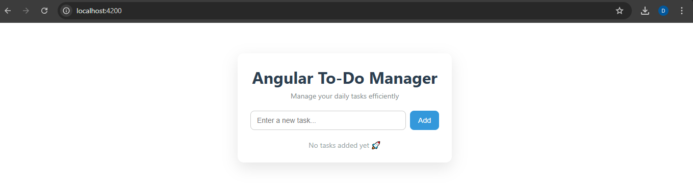
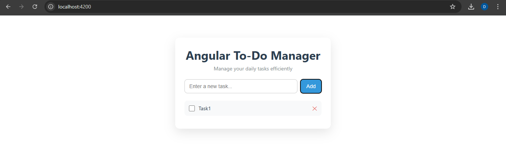

# ✅ Angular To-Do Manager

A simple and clean **Angular To-Do Manager application** built using  
**Angular Standalone Components (Angular 15+)**.

This project demonstrates core Angular concepts with a modern UI and
is ideal for beginners and portfolio projects.

---

## 📌 Project Overview

The Angular To-Do Manager allows users to:
- Add new tasks
- Mark tasks as completed
- Delete tasks
- Manage daily tasks efficiently

This is a **frontend-only Angular project** with no backend or database.

---

## 🛠️ Tech Stack

- Angular (15+)
- TypeScript
- HTML5
- CSS3
- Angular Standalone Components
- FormsModule (`ngModel`)

---

## ✨ Features

- Add, complete, and delete tasks
- Two-way data binding
- Clean and responsive UI
- Keyboard support (Enter key)
- No external UI libraries

---

## 📸 Project Screenshot

---

